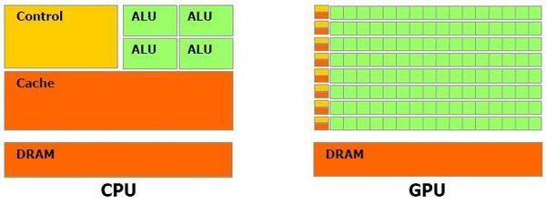

# and others

> deep learning 관련 기타 의문점들

## 층이 깊을 수록 더 정확할까?

no. 2016년 10월 기준으로 mnist 데이터셋에 대한 정확도 1위는 99.79%. 이 기법도 cnn을 기초로 했는데, 그 깊이가 그다지 깊지 않다. conv layer 2개 + fc layer 2개. 이는 비교적 단순한 이미지 데이터셋에 대해서는 신경망의 표현력을 극한까지 높일 필요가 없기 때문이라고 판단된다. 오히려 깊어질수록 낮아진다. 하지만 사물 인식에서 문제가 훨씬 복잡해지는 경우, 더 깊은 층이 높은 정확도를 구현한다

## data가 부족하다면?

data augmentation(데이터 확장)을 이용한다. 이는 데이터를 인위적으로 확장하는 것이다. 예를 들어 입력 이미지를 회전하거나 세로로 이동하거나, 이미지 일부를 잘라내거나 좌우를 뒤집는 등 미세한 변화를 주어 이미지의 개수를 늘리는 것이다. 데이터가 몇 개 없을 때 특히 효과적

transfer learning(전이 학습)을 사용한다. 이는 학습된 가중치를 다른 신경망에 복사한 다음, 그 상태로 재학습을 수행한다. 예를 들어 VGG와 구성이 같은 신경망을 준비하고, 미리 학습된 가중치를 초깃값으로 설정한 후, 새로운 데이터셋을 대상으로 재학습을 수행한다

## 층을 깊게 하는 이유

이에 대한 이론적인 근거는 아직 많이 부족한 것이 사실이다. 딥러닝의 학습에서는 층이 지나치게 깊으면 학습이 잘 되지 않고, 오히려 성능이 떨어지는 경우도 많다. 하지만 실제로 최근 상위를 차지한 기법 대부분은 딥러닝 기반이며, 그 경향은 신경망을 더 깊게 만드는 방향으로 가고 있다. 층의 깊이에 비례해 정확도가 좋아지는 것.

* 매개변수가 줄어든다

​	하나의 이미지를 5 x 5 filter를 사용할 경우 필요한 매개변수 수는 25개

​	하나의 이미지를 3 x 3 filter 2개를 사용할 경우 필요한 매개변수 수는 18개

​	따라서 보다 적은 매개변수로 같은(혹은 그 이상) 수준의 표현력을 달성할 수 있다

* 학습의 효율성 증가

  '개'를 인식하는 문제를 예로 들어볼 경우, 얕은 신경망에서 해결하려면 합성곱 계층은 개의 특징 대부분을 한 번에 이해해야 한다. 그래서 개의 특징을 이해하려면 변화가 풍부하고 많은 학습 데이터가 필요하고, 결과적으로 학습 시간이 오래 걸린다. 그러나 신경망을 깊게 하면 학습해야 할 문제를 계층적으로 분해할 수 있다. 예를 들어 처음 층에 에지 학습에 전념하여 적은 학습 데이터로 효율적으로 학습할 수 있다. 뿐만 아니라 다음 층에서는 에지 정보를 쓸 수 있어 더 고도의 패턴을 효과적으로 학습하리라 기대할 수 있다

## 더 빠르게

### GPU를 활용한 고속화

딥러닝에서는 대량의 단일 곱셈-누산(또는 큰 행렬의 곱)을 수행해야 한다. 이러한 대량 병렬 연산은 GPU의 특기(CPU는 연속적인 복잡한 계산을 잘 처리한다). 그래서 GPU를 활용하면 CPU만 쓸 때보다 더 빠르게 결과를 얻을 수 있다

* CPU와 GPU의 차이

  

  

  

  

  CPU·GPU와 같은 프로세서 내부는 크게 연산을 담당하는 산출연산처리장치(ALU)와 명령어를 해석·실행하는 컨트롤유닛(CU), 각종 데이터를 담아두는 캐시로 나뉜다. CPU는 명령어가 입력된 순서대로 데이터를 처리하는 직렬(순차) 처리 방식에 특화된 구조를 가지고 있다. 한 번에 한 가지의 명령어만 처리한다. 따라서 연산을 담당하는 ALU의 개수가 많을 필요가 없다. 최근 출시된 옥타(8)코어 CPU에는 코어 당 1개씩, 총 8개의 ALU가 탑재돼 있다. 

  

  CPU 내부 면적의 절반 이상은 캐시 메모리로 채워져 있다. 캐시 메모리는 CPU와 램(RAM)과의 속도차이로 발행하는 병목현상을 막기 위한 장치다. CPU가 처리할 데이터를 미리 RAM에서 불러와 CPU 내부 캐시 메모리에 임시로 저장해 처리 속도를 높일 수 있다. CPU가 단일 명령어를 빠르게 처리할 수 있는 비결도 이 때문이다.  반대로 GPU는 여러 명령어를 동시에 처리하는 병렬 처리 방식을 가지고 있다. 캐시 메모리 비중이 크지 않고 연산을 할 수 있는 ALU 개수가 많다. 1개의 코어에는 수백, 수천개의 ALU가 장착돼 있다. 

  

   CPU업계 관계자는 “옥타코어 CPU는 속도가 빠른 8대의 비행기로 짐을 실어 나르는 것에 비유할 수 있고, GPU는 속도는 느리지만 1000대의 기차로 짐을 실어나르는 것에 비유할 수 있다”며 “처리해야 할 명령어와 데이터의 성격에 따라 때로는 CPU, 때로는 GPU가 빠를 수가 있다”고 말했다

### 분산 학습

딥러닝 학습을 수평 확장(scale out)하자

다수의 GPU기기로 계산을 분산한다

### 연산 정밀도와 비트 줄이기

딥러닝은 높은 수치 정밀도를 요구하지 않는다. 이는 신경망의 중요한 성질 중 하나로, 신경망의 견고성에 따른 특성이다. 예를 들어 신경망은 입ㄹ겨 이미지에 노이즈가 조금 섞여 있어도 출력 결과가 잘 달라지지 않는 강건함을 보인다. 16비트 반정밀도(half-precision)만 사용해도 학습에 문제가 없다고 알려져 있다 - 엔베디아의 파스칼 아키텍쳐는 이 포맷을 지원하여, 이제는 반정밀도 부동소수점이 표준적으로 이용될 것이라 생각