# back propagation(by chain rule)

> 예측값과 실제값의 차이(cost, error)를 통해 뒤에서 부터 앞으로 추적하여 조정해야 되는 값(weight, bias)의 기울기(node의 미분)를 계산하겠다(수치 미분법으로 기울기를 계산하는 것은 복잡하다. 따라서 back propagation을 사용하고, parameter의 기울기 값이 올바른지 확인하기 위해 수치 미분법으로 구한 기울기를 비교하는데 사용한다. gradient check)

</br>

### 신경망 학습 4단계

</br>

#### 1단계 - 미니배치

훈련 데이터 중 일부를 무작위로 가져온다. 이렇게 선별한 데이터를 미니배치라 하며, 그 미니배치의 손실 함수 값을 줄이는 것이 목표

</br>

#### 2단계 - 기울기 산출 (back propagation 적용 단계)

미니배치의 손실 함수 값을 줄이기 위해 각 가중치 매개변수의 기울기를 구한다. 기울기는 손실 함수의 값을 가장 작게 하는 방향을 제시한다

</br>

#### 3단계 - 매개변수 갱신

가중치 매개변수를 기울기 방향으로 아주 조금 갱신한다

</br>

#### 4단계 - 반복

1~3단계 반복

</br>


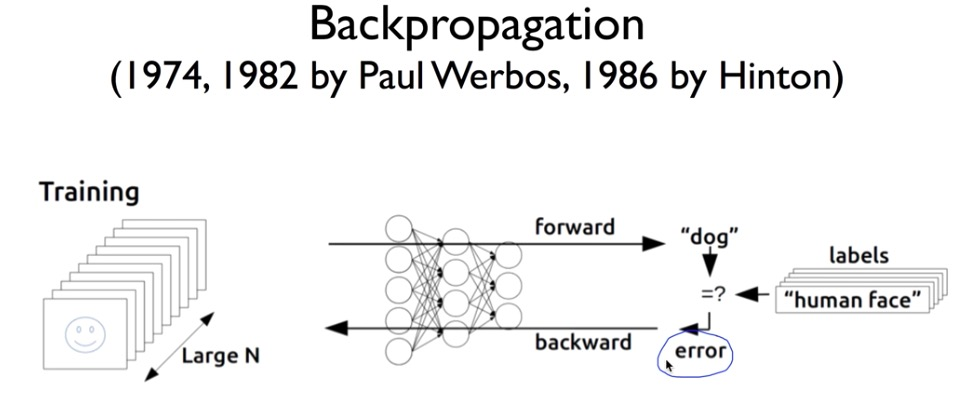


</br>

* chain rule

  합성 함수의 미분은 합성 함수를 구성하는 각 함수의 미분의 곱으로 나타낼 수 있다

  chain rule 적용해서 df/dw(w가 f에 얼마나 큰 영향을 미치는지), df/dx, df/db 등등 전부 구할 수 있다

  따라서 실제값과 예측값의 error를 기반으로 구하고자 하는 값들을 변경한다


</br>


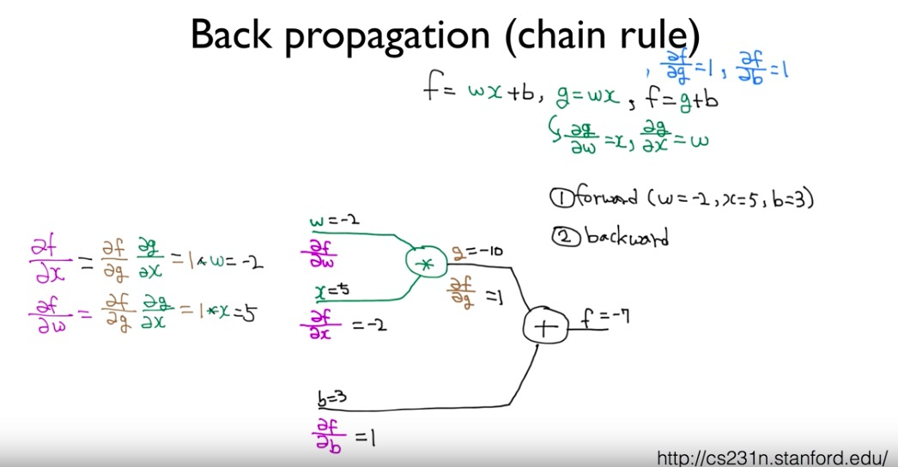


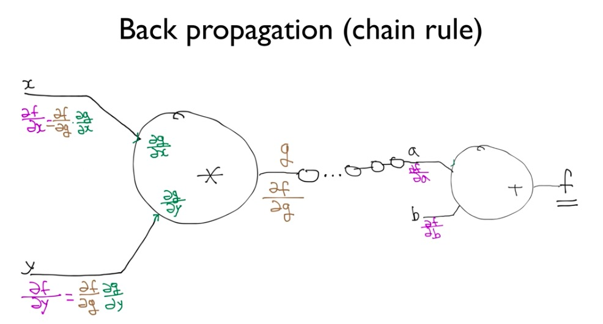


</br>

### 덧셈 node

</br>

- 덧셈 노드의 수식

  

  </br>

- 덧셈 노드의 로컬 그래디언트

  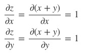

  </br>

- 덧셈 노드의 계산그래프. 현재 입력값에 대한 Loss의 변화량은 로컬 그래디언트에 흘러들어온 그래디언트를 각각 곱한다. 덧셈 노드의 역전파는 흘러들어온 그래디언트를 그대로 흘려보내는 걸 확인할 수 있다


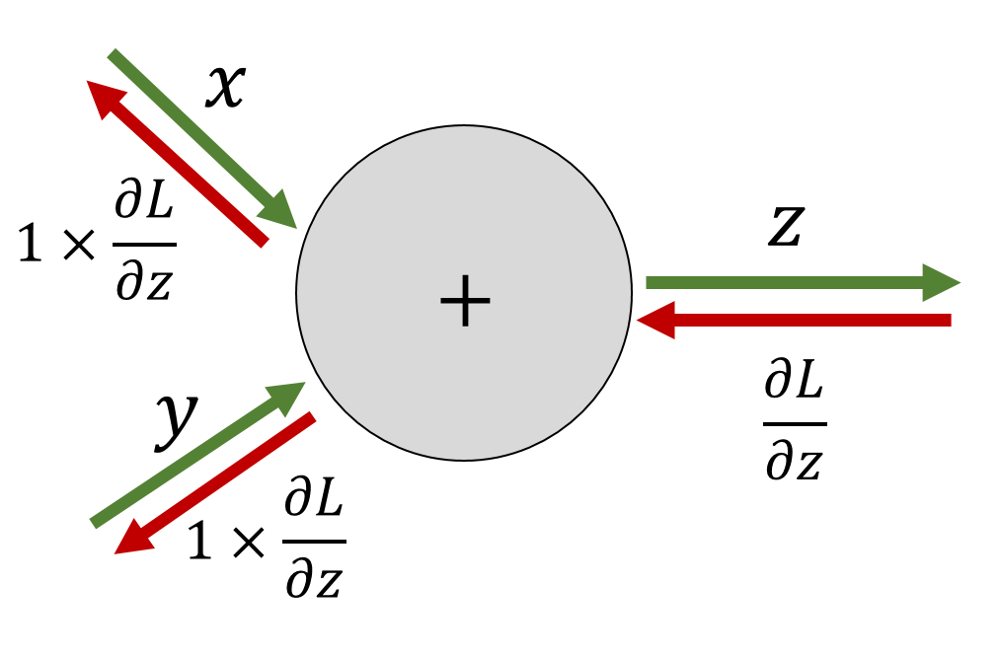


아래 외울 필요 없다. 직접 다 구할 수 있음 ^_^

</br>

### 곱셈 node

</br>

- 곱셈 노드의 수식

  

  </br>

- 곱셈 노드의 로컬 그래디언트

  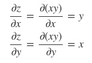

  </br>

- 곱셈 노드의 계산그래프. 현재 입력값에 대한 Loss의 변화량은 로컬 그래디언트에 흘러들어온 그래디언트를 각각 곱한다. 곱셈 노드의 역전파는 순전파 때 입력 신호들을 서로 바꾼 값을 곱해서 하류로 흘려보내는 걸 확인할 수 있다


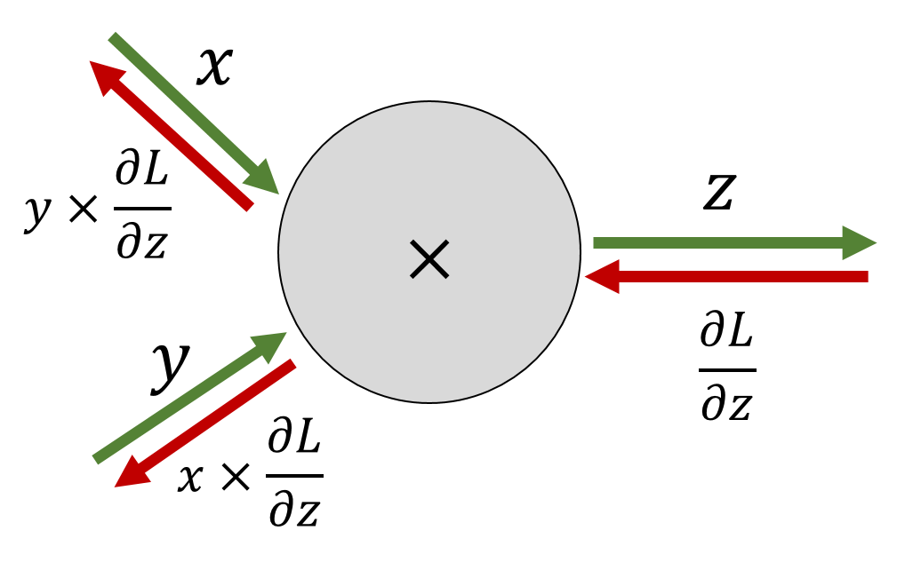


</br>

### Sigmoid node

</br>

- **시그모이드(sigmoid)** 함수

  

  </br>

- 시그모이드 노드의 로컬 그래디언트

  

  </br>

- 계산그래프

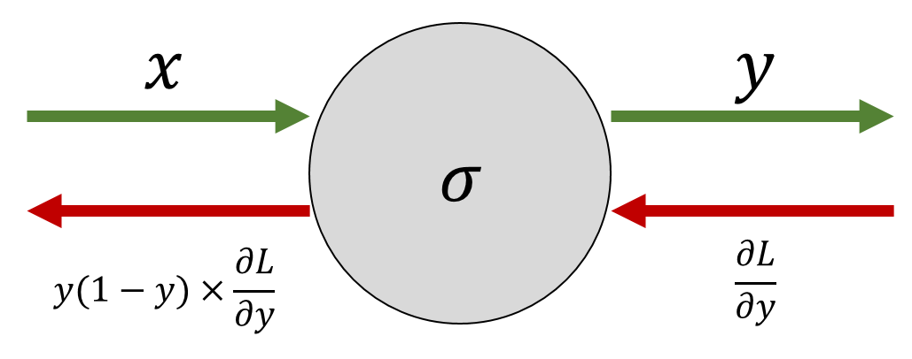


</br>

### 하이퍼볼릭탄젠트 node

</br>

* 수식

  

  </br>

* 로컬 그래디언트


</br>

* 계산그래프

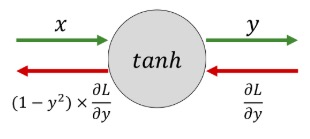

</br>


### ReLU node

</br>

* **활성화함수(activation function)**로 사용되는 **ReLU**는 수식

  

  </br>

* ReLU 노드의 로컬 그래디언트

  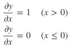

  </br>

* 계산그래프


</br>


### affine(행렬의 곱)

</br>

* 수식

  

  </br>

* 로컬 그래디언트

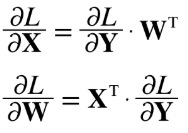


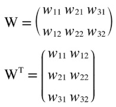

</br>


* 계산그래프

  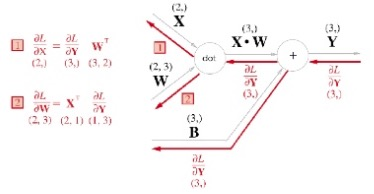

  </br>


* 배치용 affine(X가 N개 묶여 있을 경우)


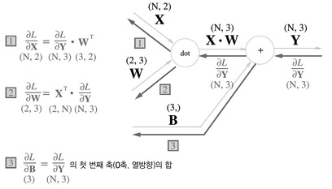

</br>


### softmax - with - loss node

뉴럴네트워크 말단에 보통 **Softmax-with-Loss** 노드를 둡니다. Softmax-with-Loss란 소프트맥스 함수와 **교차 엔트로피(Cross-Entropy)** 오차를 조합한 노드를 뜻한다. 소프트맥스 함수와 교차 엔트로피의 수식은 아래와 같다

*ak = 노드의 입력값, L=노드의 출력값(Loss), tk=정답 레이블(0 혹은 1), n=정답 범주 개수*

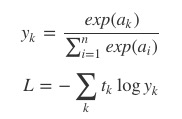

</br>


* 계산 그래프

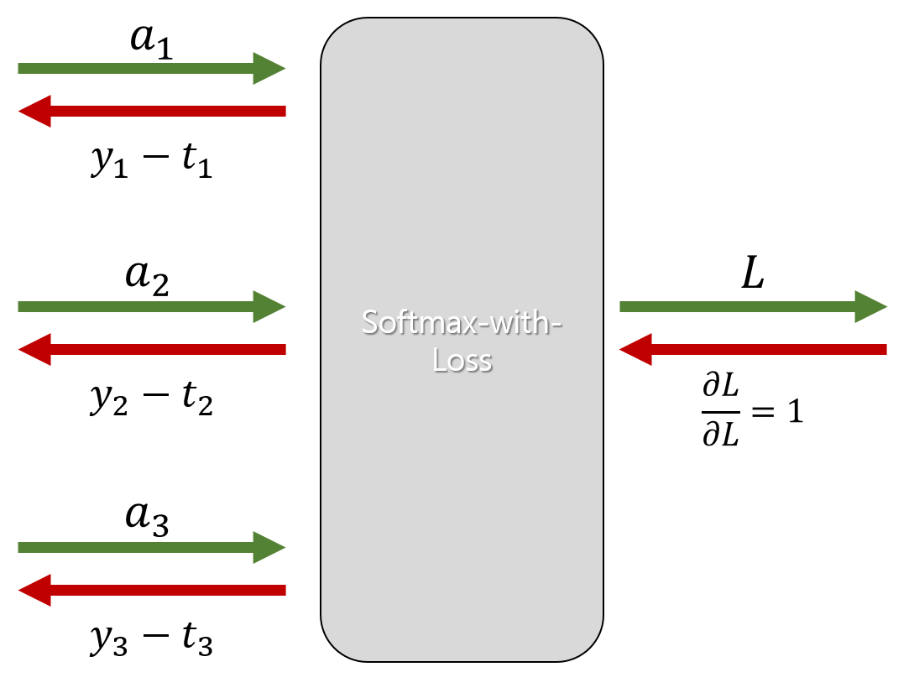

</br>


Softmax-with-Loss 노드는 a를 입력으로 받아서 Loss L을 출력한다. 역전파하는 그래디언트는 yk − tk가 된다. 예컨대 정답이 t3이라면 역전파되는 그래디언트는 각각 y1 ,y2, y3−1이 된다.

요컨대 Softmax-with-Loss 노드의 역전파 그래디언트를 구하려면 입력값에 소프트맥스 확률값을 취한 뒤, 정답 레이블에 해당하는 요소만 1을 빼주면 된다는 의미


```python
import numpy as np
p = np.exp(a) / np.sum(np.exp(a)) # softmax 확률 계산
da = np.copy(p)
da[target] -= 1 # target=정답 인덱스를 갖고 있는 변수
```


</br>

tensorflow에서는 미분을 통해 back propoagation을 적용하기 위해 그래프 형태로 만들어 놓았다


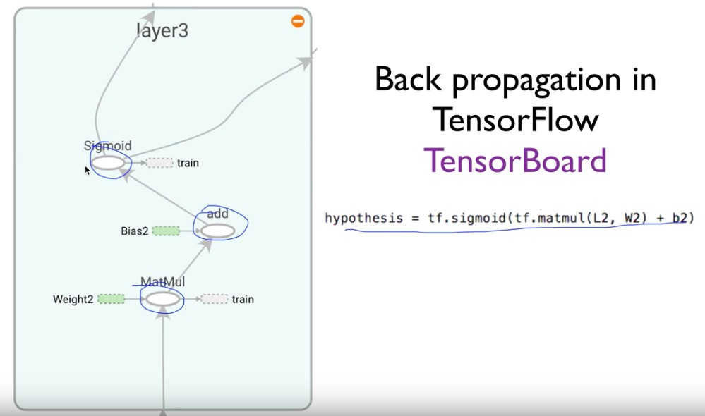


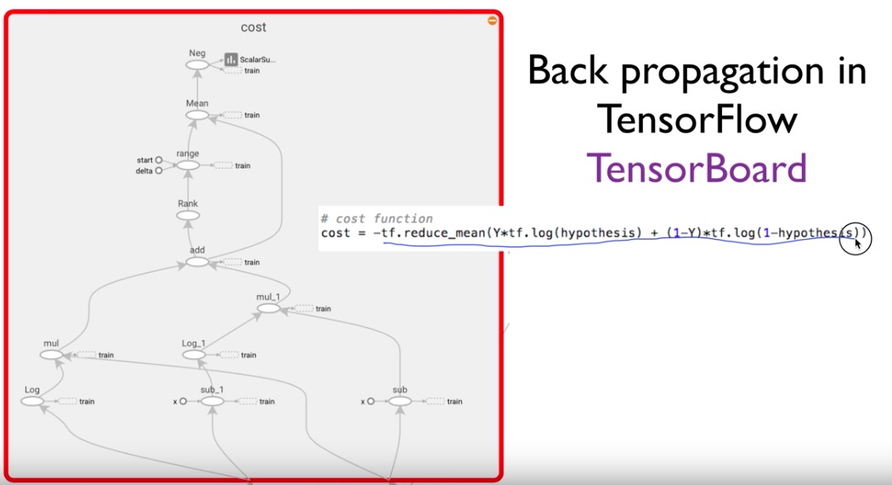